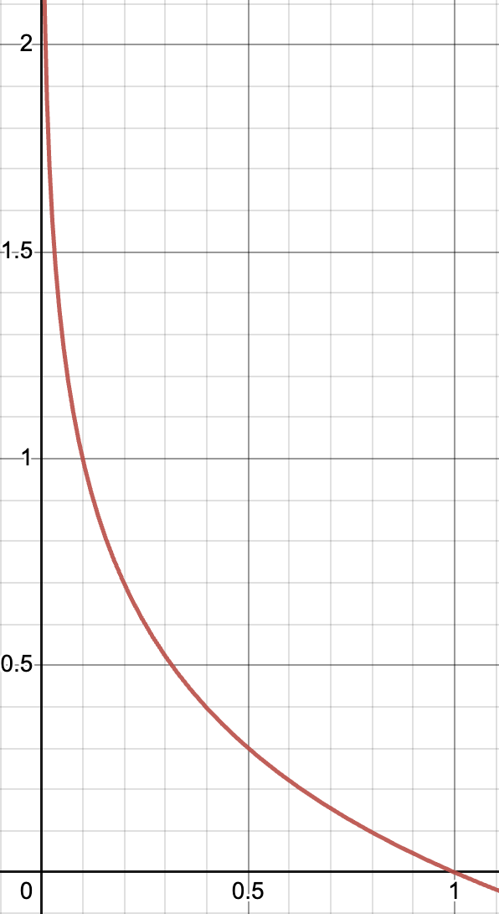

## Attribution:

The information in this post is largely derived from StatQuest with Josh Starmer, who is an amazing YouTuber who discusses statistics. I highly recommend you check out his video on Entropy as well.

## Introduction

Hello there! Welcome to this post on Entropy. Entropy is a very important term that appears in many scenarios ranging from statistics to machine learning. In this post, we’ll go beyond the formulas and discuss the essence of entropy and what the numbers really mean. Let’s begin!

## What is Entropy?

So what is entropy? In essence, entropy is a number that quantifies similarities (or differences). Let’s take a look at an example.

## Example

Say we have two groups each composed of 10 children. In the first group, we have 9 girls and 1 boy, whereas in the second group, we have 5 girls and 5 boys. How would you quantify the similarities of the two groups? It’s quite obvious that the first group with 9 girls and 1 boy is more “similar” compared to that of the second group. In the first group, most of the children are of the same gender, therefore making it more similar in that aspect. In the second group, there’s an equal distribution of boys and girls, therefore making it not as similar. This is exactly what entropy can measure.

## Intuition

Entropy can range from 0 to 1. In the case of the second group where gender is equally distributed (the most different it can get), the entropy is 1. And as one gender gradually dominates the population (like in group 1), the entropy decreases to 0. That’s it! If you’re only interested in the intuition behind entropy, you’re free to go. But why not take a look at the math and examine how the formula of entropy was actually derived?

## The Formula of Entropy

You should know from textbooks and google that the entropy formula (of a random variable X) is:

$$
-\sum_x{P(X=x)log[P(X=x)]}
$$

Hmmm…that’s complicated. I really don’t like numbers (nobody does…right?). So why don’t we read the formula through an easier term “surprise”. Everybody knows what “surprise” means right? When an event is unlikely to happen but still happen, we all get surprised! But if an event happens quite frequently, we wouldn’t be surprised at all. 

We can apply the concept of surprise to the two groups in our example. If we were to randomly pick a child form the first group, we would be surprised if we picked the boy (because there is only one out ten children). On the other hand, we wouldn’t be surprised if we picked a girl, because there are plenty in group 1. Now we can see a very crucial relationship.

> Surprise is inversely related to to probability. The probability for picking a boy in group 1 is low, therefore the surprise of picking a boy is high. The probability of picking a girl in group 1 is high, therefore the surprise of picking a girl is low.

Okay, so does that mean we can quantify surprise as the inverse of probability?

$$
\frac{1}{\text{probability}}
$$

While it does seem logical, this cannot work. I like to think of this with an example. Imagine if we have a group of children consisting of all girls. If we were to randomly pick a child from the group, we would be completely unsurprised (surprise = 0). But if we were to set surprise as the the inverse of probability, surprise would be 1.

$$
\text{surprise} = \frac{1}{P(\text{girl})}=\frac{1}{1}=1
$$

To fix this problem, we would have to make a slight adjustment to the formula by adding a log(). 

$$
\text{surprise} = log(\frac{1}{\text{probability}})
$$

By adding this log(), the surprise of picking a girl in a group with all girls would thus become 0.

$$
\text{surprise} = log(\frac{1}{1})=0
$$

But what if we want to calculate the surprise of picking a boy in a group with all girls? Using the formula, we get an undefined solution.

$$
\text{surprise} = log(\frac{1}{0}) = log(1)-log(0)=\text{undefined}
$$

While this may seem like a weird solution, it actually works out fine because:

> It doesn’t make sense to quantify the surprise of something that never happened.

Now let’s take a look at the what the formula looks like in graphical form. On the x-axis we have the probability and on the y-axis we have the surprise. Since probability only ranges from 0-1, we only have to focus within this range. We can see that when probability = 1, our surprise (y-value) is 0. Whereas when the probability approaches 0, the surprise becomes very high.

Ok, now that we’ve understood the concept of “surprise” and the formula behind it, let’s connect this term back to entropy, our focus of this post. Let’s also go back to our example of the two groups (in the first group, we have 9 girls and 1 boy, whereas in the second group, we have 5 girls and 5 boys). We can calculate the surprise of picking a child girl (or boy) from both of the groups)

| Group | P(Boy) | Boy                       | P(Girl) | Girl                      |
|-------|--------|---------------------------|---------|---------------------------|
| 1     | 0.1    | $\log\left(\frac{1}{0.1}\right) \approx 3.32$ | 0.9     | $\log\left(\frac{1}{0.9}\right) \approx 0.15$ |
| 2     | 0.5    | $\log\left(\frac{1}{0.5}\right) = 1$          | 0.5     | $\log\left(\frac{1}{0.5}\right) = 1$          |

Now for both of the groups, we can calculate the expected value of surprise (denoted by $E(surprise)$). You may recall that we can find the expected value a variable through the formula:

Headings are cool
======

You can have many headings
======

Aren't headings cool?
------